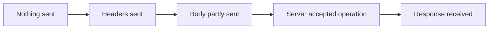

# HTTP Retry Check

HTTP Retry Check runs your Go or .NET HTTP client through six controlled HTTP/1
failure scenarios. It shows whether the client replays accepted requests,
changes a replayed body, forwards credentials to another origin, exceeds its
retry limit, or retries before the first request's outcome is known.

> **Release status:** `v0.2.0` is the next release. It will be available as a
> Go module, a NuGet package, and prebuilt CLI binaries. APIs may change before
> `v1.0.0`.

## See it fail

The default `hashicorp/go-retryablehttp` client retries a POST after the local
origin accepted it. Run the pinned example:

```bash
cd examples/adapters/go-retryablehttp
GOTOOLCHAIN=local go test -count=1 -v ./...
```

Key lines include:

```text
default aggregate: unsafe_behavior_observed
default finding: accept_then_disconnect includes retry_after_accepted_request
fixed aggregate: no_unsafe_behavior_observed
PASS
```

The test passes because it expects HTTP Retry Check to find the unsafe default
and then verifies a method-aware retry policy that passes all six scenarios.

## Why this exists

A client cannot always tell whether a server applied a request before a
connection failed. A retry in that gap can duplicate a payment, repeat a job,
or send data somewhere it was not intended to go. Conventional success-path
tests rarely reproduce these timings consistently.

### Where a retry can become dangerous



The failure point changes whether a retry is safe. Before sending, the client
needs to know that no bytes left the process. During an upload, the server may
already have part of the body. After acceptance but before the response, the
operation may have succeeded even though the client sees an error. A higher
layer can even retry after a response. “Connection failed” is not enough
information on its own.

HTTP Retry Check reproduces six HTTP/1 situations locally:

| Scenario | What it checks |
| --- | --- |
| Accepted, then disconnected | The origin accepts the request and closes without responding. A replay can repeat an accepted effect. |
| Acceptance uncertain | The origin reads the request and closes before confirming whether it took effect. A retry is unsafe because the first outcome is unknown. |
| Changed-body replay | The origin compares the bytes of any replay with the accepted request body. |
| Cross-origin redirect | One local origin redirects to another and the suite checks whether its synthetic credential marker reaches the target in the request head. |
| Retry limit | A retryable response is returned and the suite checks the selected attempt limit (two by default). |
| Delayed response | The origin accepts the request and delays its response, revealing overlapping or premature retries. |

The redirect scenario uses two origins, so a complete run reserves seven fresh
listeners on literal `127.0.0.1` for the six scenarios.

After your client returns, the suite keeps the current origin open for a
300-millisecond quiet window by default. A retry that starts later is outside
the run. The language guides describe the bounded timeout, quiet-window, and
attempt-limit settings.

## How it works

```text
your Go client/Doer                    your C# HttpMessageInvoker
         |                                        |
         v                                        v
Go six-scenario runtime                 C# six-scenario runtime
         |                                        |
         +------ seven fresh 127.0.0.1 listeners -+
                              |
                              v
                  validated six-row result
                              |
             +----------------+----------------+
             |                                 |
             v                                 v
  JSON / JUnit / Markdown / artifact    shared corpus and schemas
             |
             v
       static evidence CLI
```

## Quick start

Run the complete Go example from the repository root with Go 1.25 or later:

```bash
go env GOVERSION
go test -count=1 -run '^TestHTTPRetryScenarios$' -v ./examples/httpcheck/v1
```

The module requires Go 1.25 or later; CI uses Go 1.26.6. The example runs all
six scenarios with a minimal standard-library client and a safe redirect
policy. Test the client configuration your application actually uses first;
the [Go guide](docs/guides/go.md) and [C# guide](docs/guides/csharp.md) show an
optional proxy-free HTTP/1 baseline. Use the
[five-minute guide](docs/guides/developer-quickstart.md) for the shortest path.

To see the suite catch a concrete standard-library policy mismatch, run:

```bash
go test -count=1 \
  -run '^TestDefaultRedirectPolicyExposesSyntheticCredentialAcrossPorts$' \
  -v ./examples/httpcheck/v1
```

This test deliberately expects an unsafe result. It uses Go's default redirect
policy and passes when HTTP Retry Check catches the synthetic `Authorization`
value being forwarded between two `127.0.0.1` ports.

The source CLI can inspect the committed examples without running a client:

```bash
go run ./cmd/http-retry-check http check \
  conformance/http-retry-check/v1/projections/positive/report.json
```

Expected output:

```text
HTTP Retry Check found no unsafe behavior
```

The CLI creates Go or C# test scaffolds and reads existing evidence; your test
runs the client.

## Interpret the result

| Result | Meaning | Recommended CI treatment |
| --- | --- | --- |
| `no_unsafe_behavior_observed` | All six scenarios completed without finding unsafe behaviour. | Pass |
| `unsafe_behavior_observed` | At least one scenario found unsafe behaviour. | Fail |
| `inconclusive` | At least one scenario did not collect enough information for a result. | Fail |

If a run is inconclusive, fix the first incomplete scenario and run it again.
Unsafe findings take precedence when a row contains both unsafe and incomplete
evidence.

The repository includes examples of each overall result:

- [positive summary](conformance/http-retry-check/v1/projections/positive/summary.md)
- [unsafe summary](conformance/http-retry-check/v1/projections/unsafe/summary.md)
- [inconclusive summary](conformance/http-retry-check/v1/projections/inconclusive/summary.md)

These shared examples test both implementations. They are not recordings of
the example client, so some counters differ. The
[semantics reference](docs/reference/semantics.md#corpus-goldens) explains why.

## Scope and trust boundary

HTTP Retry Check runs your trusted client in the same process against
controlled loopback HTTP/1 endpoints using synthetic data. It does not sandbox
the client, monitor traffic sent elsewhere, or cover real credentials, ambient
proxies, TLS, HTTP/2, HTTP/3, or every retry behaviour. A green result applies
only to the six scenarios and is not a security certification.

## Evidence formats

For the same result, Go and C# produce the same six rows and the same output
bytes:

- canonical JSON for tools and validation;
- JUnit XML for test-report systems;
- GitHub-flavoured Markdown for people; and
- a four-file artifact containing `manifest.json`, `report.json`, `junit.xml`,
  and `summary.md`.

The artifact manifest records each file's size and SHA-256, plus one digest for
the complete set. Validation detects changed files, but it does not prove who
ran the test, what environment they used, or whether the process was isolated.

The shared examples and schemas live under
[`conformance/http-retry-check/v1`](conformance/http-retry-check/v1) and
[`schemas/v1`](schemas/v1).

Each scenario row records the attempt limit used for that run and the observed
protocol. Validation recalculates the attempt-limit finding from those values;
it does not trust a stored assessment.

## Guides and reference

- [Documentation home](docs/README.md)
- [Developer quick start](docs/guides/developer-quickstart.md)
- [Complete Go usage guide](docs/guides/go.md)
- [Complete C# usage guide](docs/guides/csharp.md)
- [CLI reference](docs/reference/cli.md)
- [Scenario semantics](docs/reference/semantics.md)
- [Architecture and limits](docs/architecture.md)
- [Source development](docs/guides/source-development.md)
- [go-retryablehttp example](examples/adapters/go-retryablehttp)
- [.NET HTTP resilience retry example](csharp/examples/HttpResilienceRetry)

## Contributing and support

Read [CONTRIBUTING.md](CONTRIBUTING.md) and [SUPPORT.md](SUPPORT.md).

Do not disclose a suspected vulnerability in a public issue. Follow
[SECURITY.md](SECURITY.md).

First-party material is licensed under [Apache License 2.0](LICENSE). See
[NOTICE](NOTICE) and [THIRD_PARTY_NOTICES.md](THIRD_PARTY_NOTICES.md) for
copyright and third-party notices.
